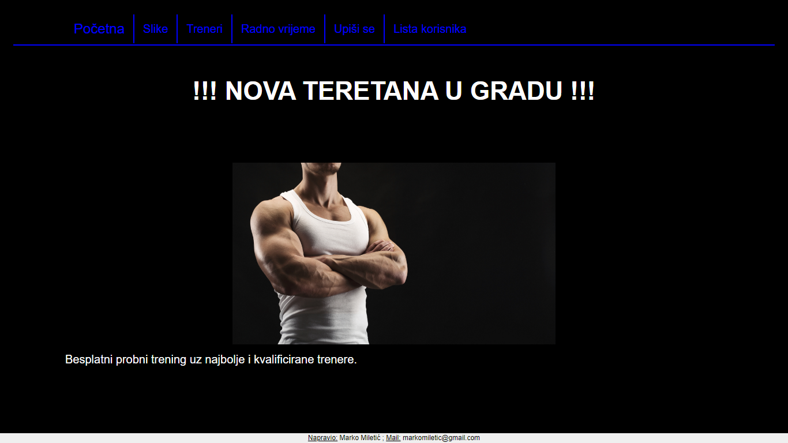
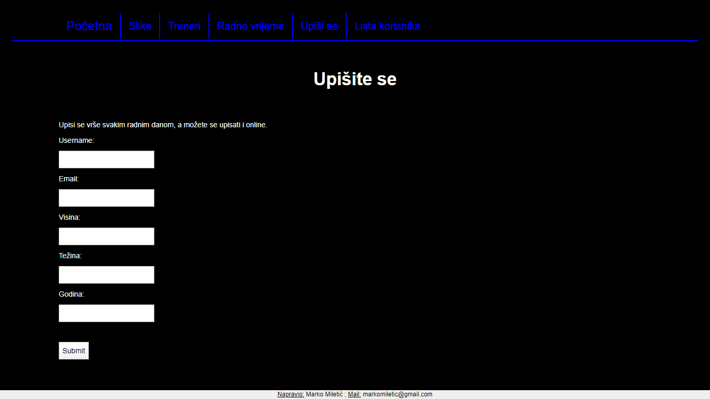
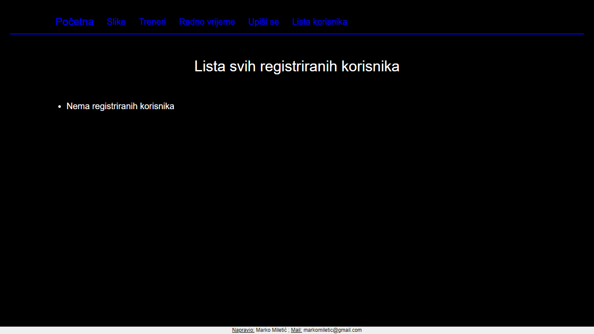
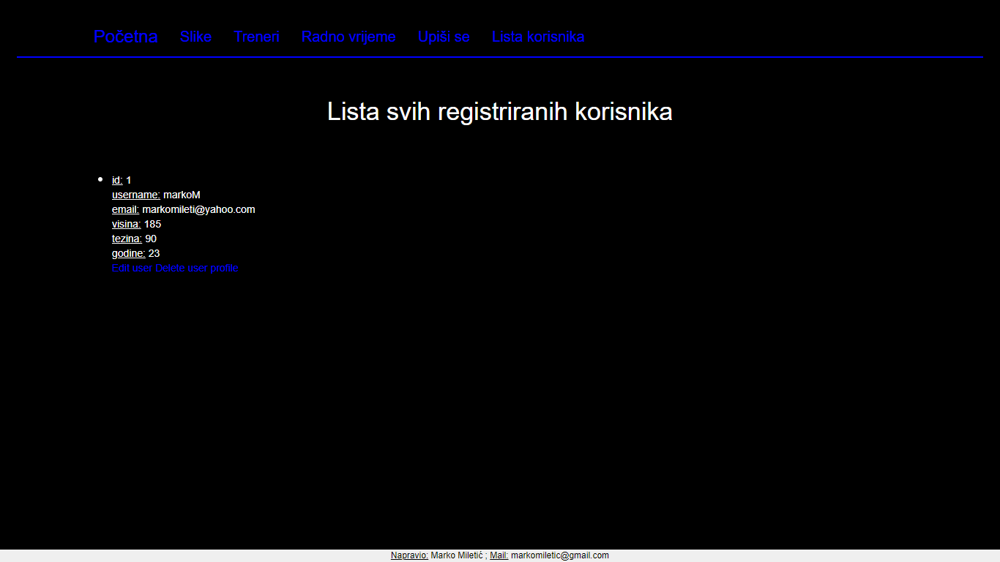
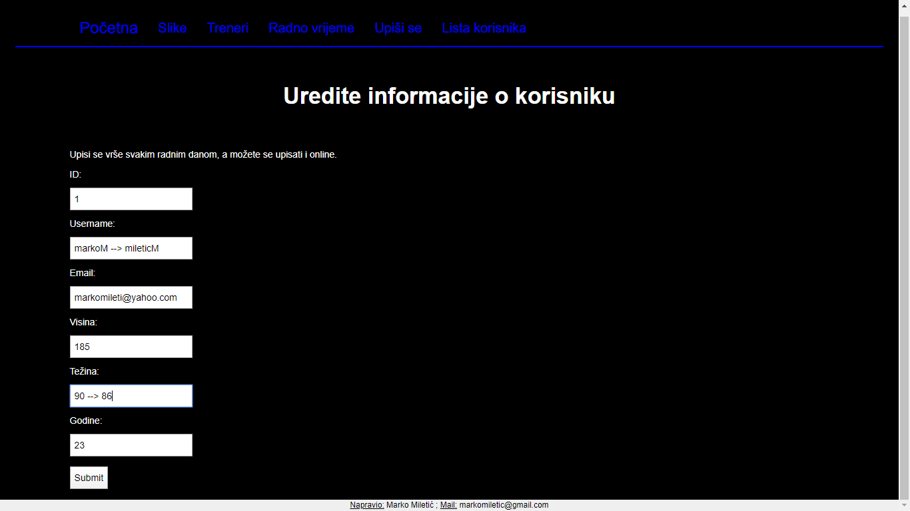

# Projekt iz kolegija Programiranje za web

Napravio sam web stranicu za teretanu. Korisnik ima mogućnost vidjeti samu 
unutrašnjost teretane, sprave koje se nalaze unutar i otprilike doživjeti
veličinu svih dvorana preko slika. Također ima mogućnost vidjeti i same 
trenere koji su zaposleni, te radno vrijeme.
Korisnik se može registrirat preko Interneta upisujući svoje podatke koji
se zatim spremaju u bazu podataka, a kasnije se isti ti podatci mogu 
obrisati ili uređivati.
 
 

## Pokretanje aplikacije 
Pri izradi web stranice sam koristio program PyCharm. 
Prvo se pokrene datoteka <b>database.py</b> da se kreira baza podataka, tj tablica u koju se spremaju podatci koji se unose. 
A poslije toga se pokrene datoteka </b>app.py</b> da se dobije poveznica na kojoj možemo vidjeti web stranicu.

## Izgled stranice
Kad se pokrene aplikacija, prikaže se ..
 
  
Klikom na <b>Upiši se</b> otvara se dio stranice gdje korisnik može upisati svoje podatke, 
 a to izgleda
  
 
A klikom na <b>Lista korisnika</b> otvara se dio stranice gdje se vidi popis svih registriranih
korisnika. Kad nema nikog upisanog u bazu podataka, to izgleda ..
  
 
A kad imamo registriranog korisnika, možemo njegov profil urediti ali i obrisati. 
Ispis s registriranom korisnikom izgleda ..
  
 
Uređivanje korisnika izgleda ..
  
 
Te na kraju vidimo i ponovni ispis registriranih korisnika poslije uređivanja.
  
